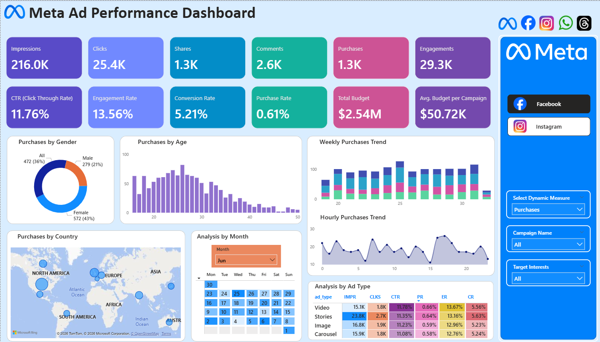
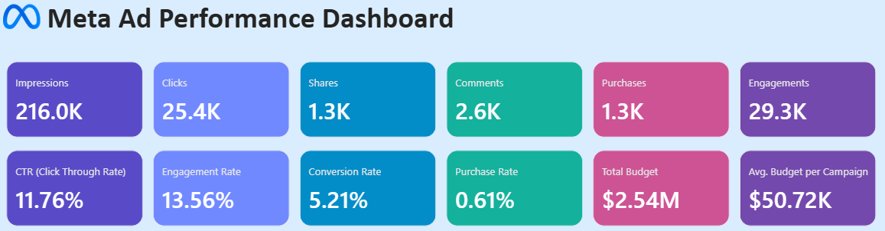
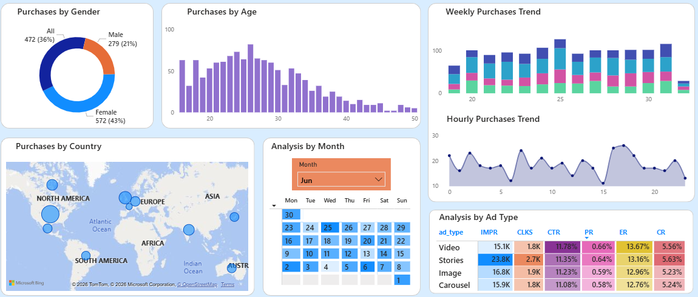
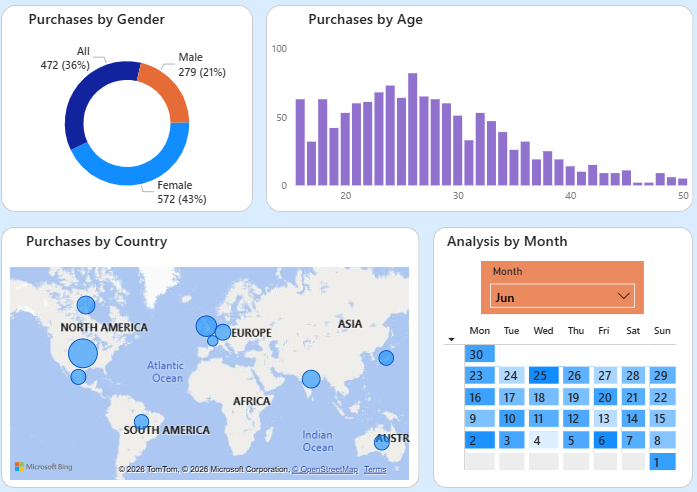
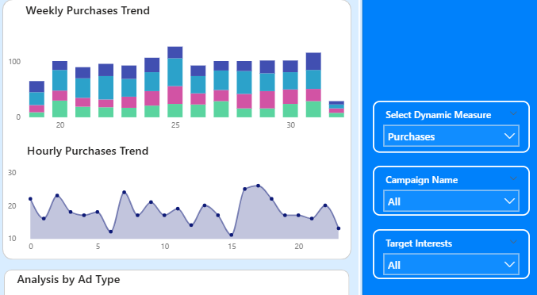
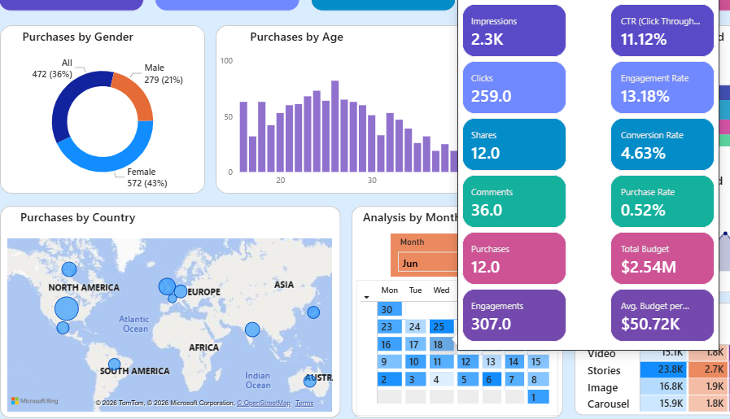

# 📢 Meta Ads Performance Dashboard | Power BI

## 📌 Overview
This project analyzes Meta (Facebook & Instagram) ad campaign performance using Power BI.

The dashboard provides insights into key marketing metrics such as impressions, clicks, conversions, and engagement, helping optimize ad performance and budget allocation.

---

## 🎯 Objective
- Analyze ad campaign performance across Facebook and Instagram  
- Track key KPIs such as CTR, conversions, and engagement  
- Understand audience behavior and targeting effectiveness  
- Optimize marketing strategies and budget allocation  

---

## 🛠 Tools Used
- Power BI  
- DAX (Data Analysis Expressions)  
- Data Modeling  
- Excel (for data preparation)  

---

## 📊 Key KPIs

- **Impressions** – Number of times ads were shown  
- **Clicks** – User interactions with ads  
- **Engagements** – Total interactions (clicks, shares, comments)  
- **Purchases** – Conversions from ads  
- **CTR (Click Through Rate)** – Clicks ÷ Impressions  
- **Engagement Rate** – Engagements ÷ Impressions  
- **Conversion Rate** – Purchases ÷ Clicks  
- **Purchase Rate** – Purchases ÷ Impressions  
- **Total Budget** – Total campaign spend  

---

## 📈 Dashboard Features

### 🎯 Dynamic Metrics Selection
- Switch between metrics like impressions, clicks, and conversions using a parameter

### 👤 Audience Analysis
- Gender-based performance (Donut Chart)  
- Age group performance (Bar Chart)  

### 🌍 Geographic Analysis
- Country-level performance using map visualization  

### 📅 Time-Based Analysis
- Calendar heatmap for monthly trends  
- Weekly trend analysis by ad type  
- Hourly trend (peak activity hours)  

### 📊 Ad Performance Comparison
- Matrix showing performance across:
  - Ad types  
  - Platforms (Facebook vs Instagram)  

---

## 🔍 Key Insights

- Identified the most engaging audience segments based on gender and age  
- Analyzed geographic regions with highest ad performance  
- Detected peak hours for user engagement  
- Compared performance between Facebook and Instagram  
- Identified best-performing ad types and campaigns  
- Optimized insights for better ROI and targeting  

---

## 📷 Dashboard Preview

### Main Dashboard

### KPIs 

### Data Model

### Other Visualizations

---

## 🧠 Skills Demonstrated

- Data Analysis  
- Power BI Dashboard Development  
- DAX Calculations  
- Marketing Analytics  
- Data Visualization  
- Business Intelligence  

---

## 📂 Project Files

- Power BI File (.pbix)  
- Dashboard Images  
- Data Model  
